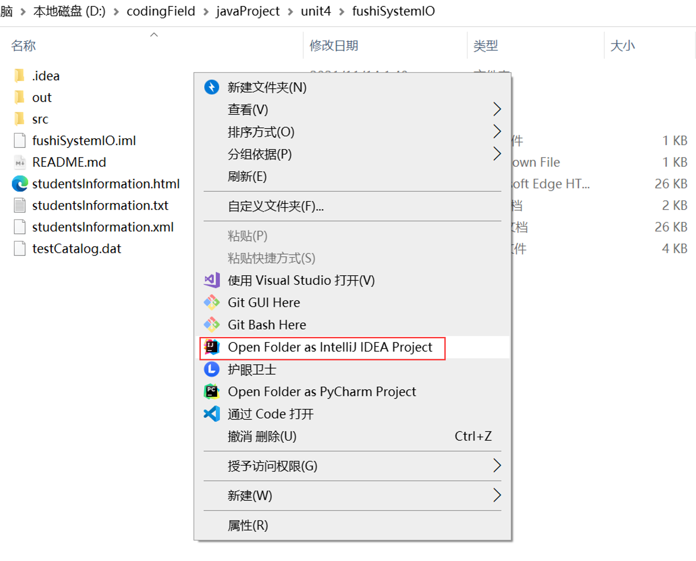
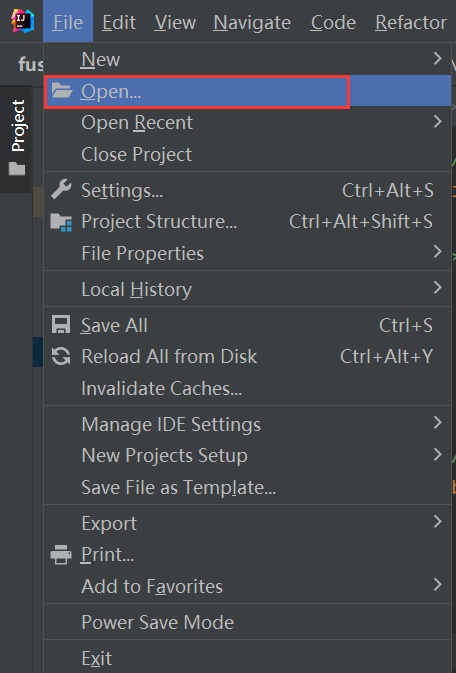
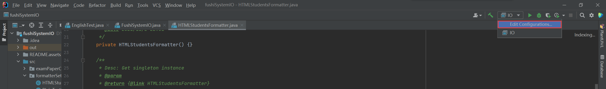
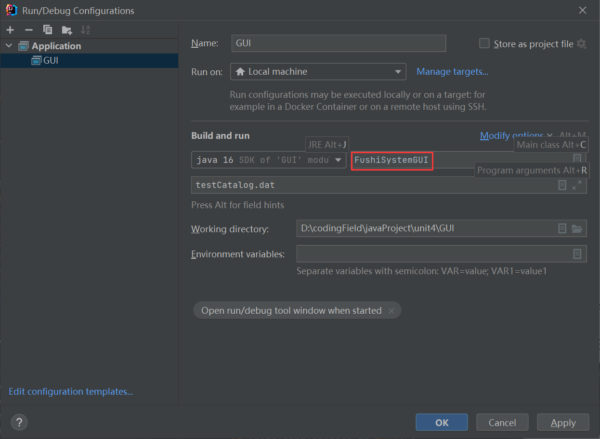
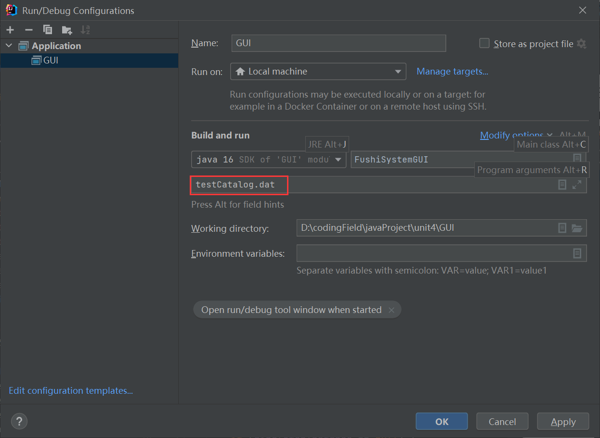
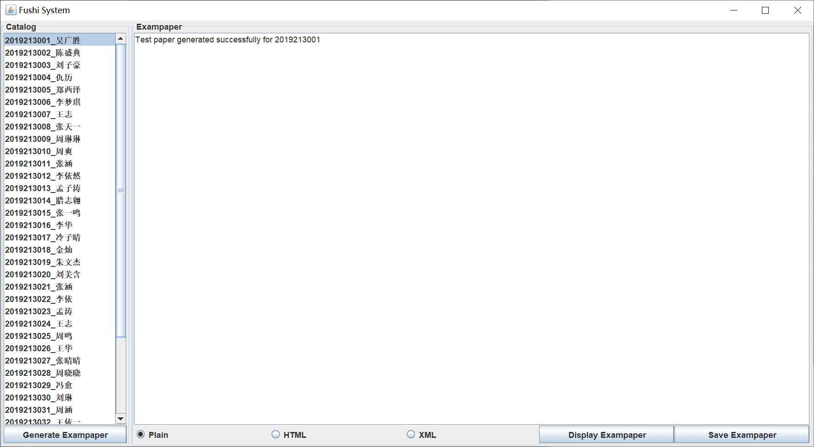
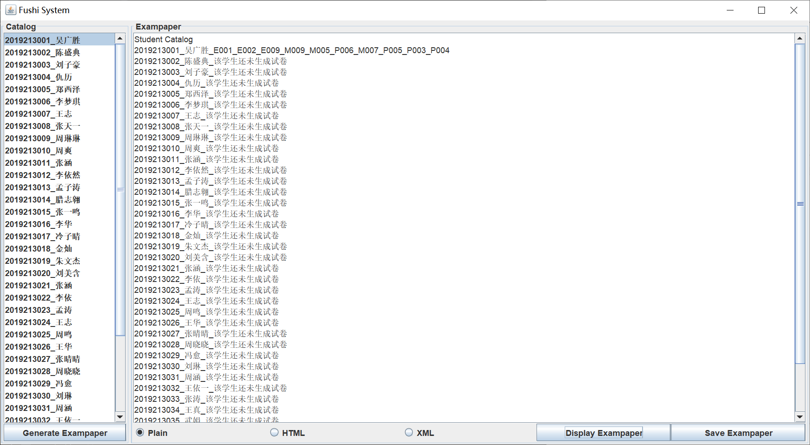
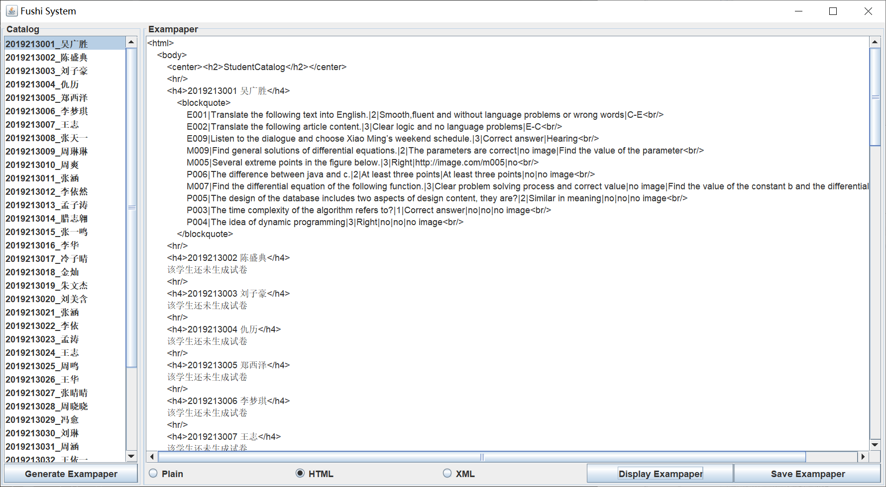
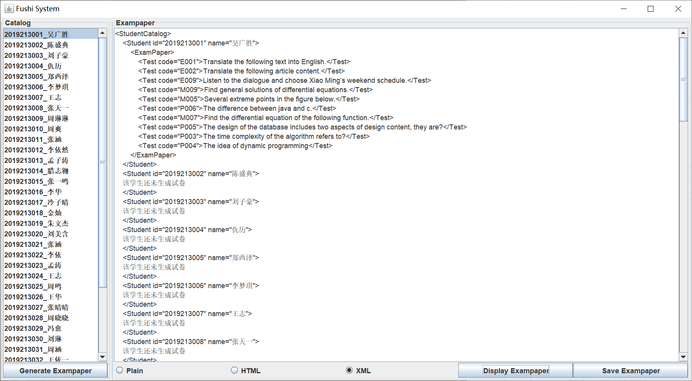
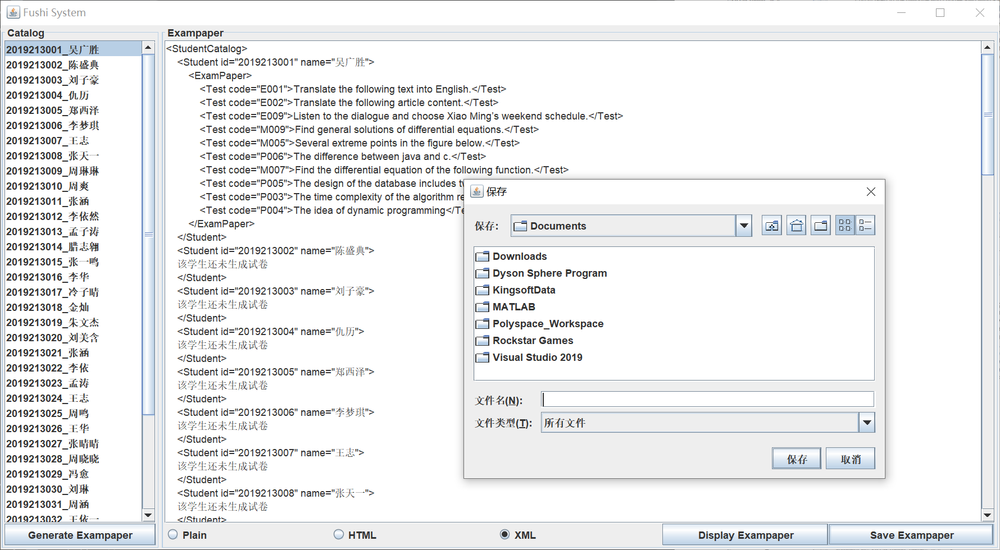

西北工业大学 软件学院 面向对象编程与设计实验

作者：项裕顺

# 第四次实验说明文档


## 运行说明


### 1. 打开工程文件

在工程目录下，点击鼠标右键，选择`Open Folder as IntelliJ IDEA Project`，由`IntelliJ IDEA`打开。



或者打开`IntelliJ IDEA`，选择`Open`，然后选择你要打开的工程文件目录即可。




### 2. 参数配置过程

1. 在IDEA右上角选择`Edit Configurations`

   

2. 在`Build and run`区域的指定位置（如图所示）填上主类的位置（此处为`FushiSystemGUI`)


3. 配置项目的参数（即`testCatalog.dat`的路径）：在图示位置添加`testCatalog.dat`即可点击`OK`保存配置

### 3. 运行程序

最后在IDEA中点击`run`按键或同时按下`Shift`+`F10`运行工程文件。


### （另一种方法）直接运行jar文件

在工程目录的`powershell`命令行下输入指令：

``` shell
$ java -jar .\out\artifacts\GUI_jar\GUI.jar .\testCatalog.dat
```

即可运行本工程打包后的jar文件


## 运行截图

### Generate Exampaper




### Display Exampaper








### Save Exampaper


